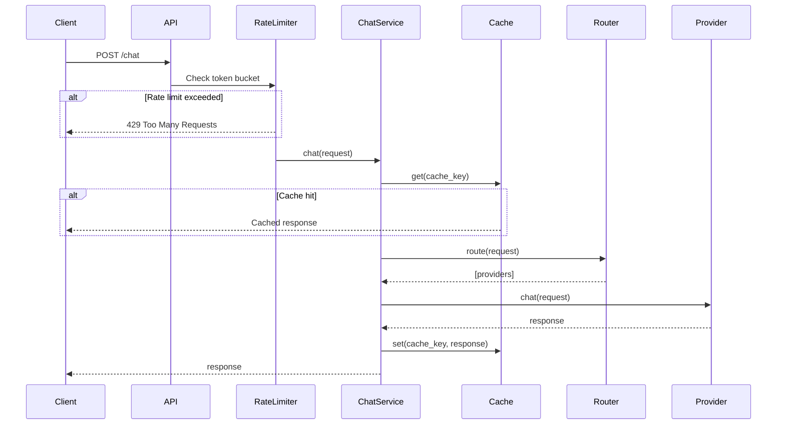

## Overview

LLM Gateway Core uses a layered architecture that separates concerns between routing, caching, rate limiting, and provider communication. The system is built around a central `ChatService` that orchestrates the entire request lifecycle.

## System Components

The gateway consists of four core components:

<CardGroup cols={2}>
  <Card title="Router" icon="route">
    Decides which provider handles each request based on model hints
  </Card>
  <Card title="Cache Layer" icon="database">
    Redis-backed caching to avoid redundant provider calls
  </Card>
  <Card title="Rate Limiter" icon="gauge">
    Token bucket algorithm with Redis Lua scripts for distributed limiting
  </Card>
  <Card title="Provider Clients" icon="plug">
    Abstracted interfaces to LLM providers (Gemini, Ollama)
  </Card>
</CardGroup>

## Data Flow

The request lifecycle follows this sequence:



### Request Processing Steps

1. **Authentication & Rate Limiting** - API endpoint validates the API key and checks rate limits
2. **Cache Check** - System generates a cache key and checks Redis for existing response
3. **Provider Routing** - Router selects appropriate provider based on model hints
4. **Provider Call** - Request is sent to provider with timeout and retry logic
5. **Cache Population** - Successful responses are stored in Redis with TTL
6. **Metrics Recording** - Prometheus metrics are recorded throughout the pipeline

## Core Service Implementation

The `ChatService` class in `app/core/service.py` orchestrates the entire flow:

```python
class ChatService:
    """
    Core execution layer.
    """
    def __init__(self):
        self.router = Router()
        self.cache = RedisCache(ttl_seconds=settings.CACHE_TTL_SECONDS)

    async def chat(self, request: ChatRequest) -> ChatResponse:
        """
        Execute a chat completion request.
        Check cache first, then route to providers with retries.
        """
        REQUEST_TOTAL.inc()
        start = time.time()
        try: 
            ACTIVE_REQUESTS.inc()
            cache_key = build_cache_key(request)
            cached_response = self.cache.get(cache_key)
            if cached_response:
                print(f"[CACHE HIT] key={cache_key}")
                return cached_response.model_copy(update={"cached": True})
            print(f"[CACHE MISS] key={cache_key}")

            providers = self.router.route(request)
            last_exception = None
            
            for provider in providers:
                for attempt in range(settings.PROVIDER_MAX_RETRIES):
                    try:
                        response = await self._call_provider(provider, request)
                        self.cache.set(cache_key, response)
                        return response
                    except Exception as e:
                        last_exception = e
                        continue
            raise last_exception if last_exception else Exception("No providers available")
        finally:
            duration = time.time() - start
            REQUEST_LATENCY.observe(duration)
            ACTIVE_REQUESTS.dec()
```

<Note>
The service automatically marks cached responses with `cached: true` in the response payload, allowing clients to identify cache hits.
</Note>

## Provider Call Handling

Provider calls include timeout protection and metrics recording:

```python
async def _call_provider(self, provider, request):
    """
    Call a provider and record metrics.
    """
    PROVIDER_CALLS.labels(provider=provider.name).inc()
    start = time.time()
    try: 
        print(f"[PROVIDER CALL] {provider.name} | Timeout: {settings.PROVIDER_TIMEOUT_SECONDS}s")
        response = await asyncio.wait_for(provider.chat(request), timeout=settings.PROVIDER_TIMEOUT_SECONDS)
        return response
    except asyncio.TimeoutError:
        print(f"[PROVIDER TIMEOUT] {provider.name}")
        PROVIDER_FAILURES.labels(provider=provider.name).inc()
        raise
    except Exception as e:
        print(f"[PROVIDER ERROR] {provider.name}: {str(e)}")
        PROVIDER_FAILURES.labels(provider=provider.name).inc()
        raise 
    finally:
        duration = time.time() - start
        PROVIDER_LATENCY.labels(provider=provider.name).observe(duration)
```

## Retry Strategy

The system implements a retry mechanism that:

- Attempts each provider up to `PROVIDER_MAX_RETRIES` times (configured via environment)
- Falls through to the next provider if all retries are exhausted
- Tracks the last exception to provide meaningful error messages
- Records all failures in Prometheus metrics for observability

## API Entry Point

The FastAPI endpoint in `app/api/v1/chat.py` ties everything together:

```python
rate_limiter = RedisRateLimiter(
    capacity=settings.RATE_LIMITER_CAPACITY,
    refill_rate=settings.RATE_LIMITER_REFILL_RATE
)

async def rate_limit_dependency(request: Request):
    """
    FastAPI dependency to enforce rate limiting and record metrics.
    Also validates the API key if provided.
    """
    api_key = request.headers.get("X-API-Key")
    valid_keys = [k.strip() for k in settings.API_KEYS.split(",") if k.strip()]
    
    if api_key not in valid_keys:
         raise HTTPException(
            status_code=401,
            detail="Invalid or missing API Key"
        )

    key = api_key or request.client.host
    if not rate_limiter.allow(key):
        RATE_LIMIT_BLOCKED.inc()
        raise HTTPException(
            status_code=429, 
            detail="Too many requests. Please wait before trying again."
        )
    
    RATE_LIMIT_ALLOWED.inc()

chat_service = ChatService()

@app.post("", response_model=ChatResponse, dependencies=[Depends(rate_limit_dependency)])
async def chat(request: ChatRequest):
    """
    Entry point for all chat completions.
    Processes the chat request and returns a chat response.
    """
    return await chat_service.chat(request)
```

<Tip>
The rate limiting is enforced at the dependency level, ensuring all requests are checked before reaching the service layer.
</Tip>

## Configuration

All components are configured through environment variables loaded via `app.core.config.settings`:

- `CACHE_TTL_SECONDS` - How long cached responses are valid
- `PROVIDER_TIMEOUT_SECONDS` - Maximum time to wait for provider response
- `PROVIDER_MAX_RETRIES` - Number of retry attempts per provider
- `RATE_LIMITER_CAPACITY` - Token bucket capacity
- `RATE_LIMITER_REFILL_RATE` - Tokens added per second
- `REDIS_URL` - Redis connection string
- `API_KEYS` - Comma-separated valid API keys

## Next Steps

<CardGroup cols={2}>
  <Card title="Routing Logic" href="/routing">
    Learn how model hints map to providers
  </Card>
  <Card title="Caching Strategy" href="/caching">
    Understand cache key generation and storage
  </Card>
  <Card title="Rate Limiting" href="/rate-limiting">
    Deep dive into token bucket implementation
  </Card>
  <Card title="API Reference" href="/api/chat">
    Explore the complete API documentation
  </Card>
</CardGroup>