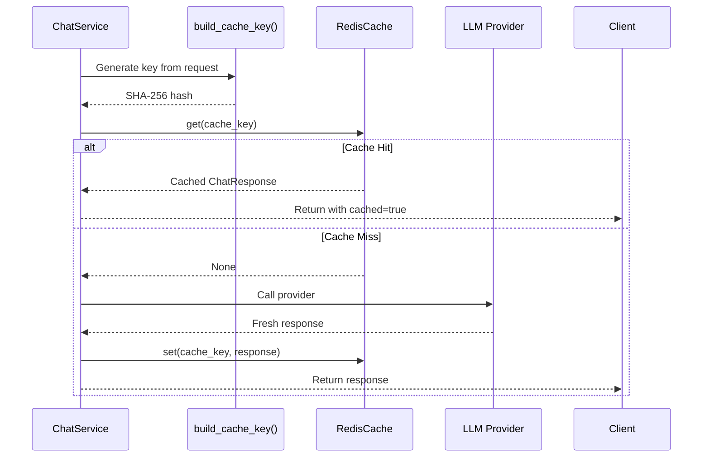

## Overview

LLM Gateway Core uses Redis-backed caching to avoid redundant calls to LLM providers. When a request is made, the system first checks if an identical request has been cached, returning the cached response immediately if available.

## Benefits of Caching

<CardGroup cols={2}>
  <Card title="Reduced Latency" icon="gauge-high">
    Cache hits return in milliseconds instead of seconds
  </Card>
  <Card title="Cost Savings" icon="dollar-sign">
    Avoid paying for duplicate API calls to cloud providers
  </Card>
  <Card title="Rate Limit Protection" icon="shield">
    Reduce load on provider APIs and avoid hitting their limits
  </Card>
  <Card title="Improved Reliability" icon="check">
    Serve cached responses even when providers are slow or down
  </Card>
</CardGroup>

## Cache Implementation

The `RedisCache` class in `app/core/cache.py` handles all caching operations:

```python
from typing import Any, Optional
import redis
from app.core.config import settings
from app.core.metrics import CACHE_HITS, CACHE_MISSES
from app.api.v1.schemas import ChatResponse

class RedisCache:
    def __init__(self, ttl_seconds: int = settings.CACHE_TTL_SECONDS):
        self.ttl = ttl_seconds
        self.client = redis.from_url(settings.REDIS_URL, decode_responses=True)
    
    def get(self, key: str) -> Optional[ChatResponse]:
        try:
            data = self.client.get(key)
            if not data:
                CACHE_MISSES.inc()
                return None
            
            CACHE_HITS.inc()
            # Parse back into ChatResponse
            return ChatResponse.model_validate_json(data)
        except Exception as e:
            print(f"[CACHE ERROR] get key={key}: {e}")
            CACHE_MISSES.inc()
            return None
    
    def set(self, key: str, value: ChatResponse):
        try:
            # Serialize ChatResponse to JSON
            serialized_value = value.model_dump_json()
            self.client.set(key, serialized_value, ex=self.ttl)
        except Exception as e:
            print(f"[CACHE ERROR] set key={key}: {e}")
```

Source: `app/core/cache.py:1-33`

## Cache Key Generation

The cache key is generated from the request parameters using a deterministic hash function in `app/core/cache_key.py`:

```python
import hashlib
import json


def build_cache_key(request: dict) -> str:
    normalized = {
        "messages": [m.model_dump() for m in request.messages],
        "model_hint": request.model_hint,
        "max_tokens": request.max_tokens,
    }

    raw = json.dumps(normalized, sort_keys=True)
    return hashlib.sha256(raw.encode("utf-8")).hexdigest()
```

Source: `app/core/cache_key.py:1-13`

### Key Components

The cache key includes:

1. **messages** - The full conversation history
2. **model_hint** - The routing hint (affects which provider is used)
3. **max_tokens** - Token limit for the response

<Note>
The key is deterministic - identical requests always generate the same cache key, ensuring cache hits for duplicate requests.
</Note>

### SHA-256 Hashing

The system uses SHA-256 to create a fixed-length key from the request:

- **Deterministic** - Same input always produces same hash
- **Compact** - 64-character hex string regardless of request size
- **Collision-resistant** - Extremely unlikely for different requests to produce the same hash

## Cache Flow



## Integration with ChatService

The cache is checked at the beginning of each request in `ChatService.chat()`:

```python
async def chat(self, request: ChatRequest) -> ChatResponse:
    """
    Execute a chat completion request.
    Check cache first, then route to providers with retries.
    """
    REQUEST_TOTAL.inc()
    start = time.time()
    try: 
        ACTIVE_REQUESTS.inc()
        cache_key = build_cache_key(request)
        cached_response = self.cache.get(cache_key)
        if cached_response:
            print(f"[CACHE HIT] key={cache_key}")
            return cached_response.model_copy(update={"cached": True})
        print(f"[CACHE MISS] key={cache_key}")

        providers = self.router.route(request)
        # ... provider call logic ...
        response = await self._call_provider(provider, request)
        self.cache.set(cache_key, response)
        return response
```

Source: `app/core/service.py:39-63`

<Tip>
Cached responses are marked with `cached: true` in the response payload, allowing clients to distinguish between fresh and cached responses.
</Tip>

## Time-to-Live (TTL)

Cached responses expire after a configurable TTL:

```python
self.client.set(key, serialized_value, ex=self.ttl)
```

The TTL is set via the `CACHE_TTL_SECONDS` environment variable. Choose your TTL based on:

- **Short TTL (60-300s)** - For rapidly changing data or when freshness is critical
- **Medium TTL (600-3600s)** - Balanced approach for most use cases
- **Long TTL (3600s+)** - For static content or when cost savings are paramount

<Warning>
Very long TTLs may serve stale responses. Consider your use case when configuring TTL.
</Warning>

## Serialization

The cache serializes `ChatResponse` objects to JSON:

### Writing to Cache

```python
serialized_value = value.model_dump_json()
self.client.set(key, serialized_value, ex=self.ttl)
```

### Reading from Cache

```python
data = self.client.get(key)
return ChatResponse.model_validate_json(data)
```

This approach:
- Uses Pydantic's built-in JSON serialization
- Ensures type safety on deserialization
- Handles nested objects and validation automatically

## Error Handling

The cache implements graceful degradation:

```python
try:
    data = self.client.get(key)
    if not data:
        CACHE_MISSES.inc()
        return None
    
    CACHE_HITS.inc()
    return ChatResponse.model_validate_json(data)
except Exception as e:
    print(f"[CACHE ERROR] get key={key}: {e}")
    CACHE_MISSES.inc()
    return None
```

**Failure behavior:**
- Cache errors are logged but not raised
- Cache misses are recorded in metrics
- Request continues to provider on cache failure
- System remains operational even if Redis is down

<Note>
The cache "fails open" - if Redis is unavailable, requests still work but go directly to providers.
</Note>

## Metrics and Observability

The cache records Prometheus metrics for monitoring:

```python
CACHE_HITS.inc()   # Successful cache retrieval
CACHE_MISSES.inc() # Cache miss or error
```

### Key Metrics to Monitor

- **Cache Hit Rate** - `CACHE_HITS / (CACHE_HITS + CACHE_MISSES)`
- **Cache Errors** - Logged to console for debugging
- **Provider Savings** - Requests avoided by cache hits

## Configuration

Cache behavior is controlled by environment variables:

```bash
# Redis connection
REDIS_URL=redis://localhost:6379/0

# Cache TTL in seconds
CACHE_TTL_SECONDS=600
```

## Cache Invalidation

Currently, the cache uses TTL-based expiration only. To invalidate cache entries:

### Manual Invalidation

```bash
# Flush all cache entries
redis-cli FLUSHDB

# Delete specific key
redis-cli DEL <cache_key_hash>
```

### Selective Invalidation

To implement selective invalidation, you could extend the `RedisCache` class:

```python
def delete(self, key: str):
    """Delete a specific cache entry."""
    try:
        self.client.delete(key)
    except Exception as e:
        print(f"[CACHE ERROR] delete key={key}: {e}")

def flush_all(self):
    """Clear all cache entries."""
    try:
        self.client.flushdb()
    except Exception as e:
        print(f"[CACHE ERROR] flush_all: {e}")
```

## Best Practices

<AccordionGroup>
  <Accordion title="Choose appropriate TTL">
    Set TTL based on how quickly your data becomes stale. For LLM responses, 5-10 minutes is often a good balance.
  </Accordion>
  
  <Accordion title="Monitor cache hit rate">
    Track `CACHE_HITS / (CACHE_HITS + CACHE_MISSES)`. A low hit rate may indicate TTL is too short or requests are too diverse.
  </Accordion>
  
  <Accordion title="Use Redis persistence">
    Configure Redis with AOF or RDB persistence to preserve cache across restarts and maximize hit rate.
  </Accordion>
  
  <Accordion title="Consider cache warming">
    For predictable queries, pre-populate the cache during deployment to improve initial response times.
  </Accordion>
</AccordionGroup>

## Example: Cache Hit vs Miss

### First Request (Cache Miss)

```bash
curl -X POST http://localhost:8000/chat \
  -H "X-API-Key: your-key" \
  -H "Content-Type: application/json" \
  -d '{
    "messages": [{"role": "user", "content": "Hello"}],
    "model_hint": "fast"
  }'

# Response (after 2s provider call)
{
  "content": "Hello! How can I help you?",
  "cached": false
}
```

### Second Identical Request (Cache Hit)

```bash
curl -X POST http://localhost:8000/chat \
  -H "X-API-Key: your-key" \
  -H "Content-Type: application/json" \
  -d '{
    "messages": [{"role": "user", "content": "Hello"}],
    "model_hint": "fast"
  }'

# Response (instant, <10ms)
{
  "content": "Hello! How can I help you?",
  "cached": true
}
```

## Next Steps

<CardGroup cols={2}>
  <Card title="Architecture" href="/architecture">
    Understand how caching fits into the overall architecture
  </Card>
  <Card title="Rate Limiting" href="/rate-limiting">
    Learn about Redis-based rate limiting
  </Card>
  <Card title="Routing" href="/routing">
    See how model_hint affects cache keys
  </Card>
  <Card title="Monitoring" href="/monitoring/overview">
    Set up metrics and observability
  </Card>
</CardGroup>