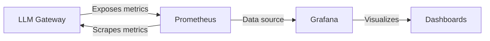

LLM Gateway Core includes a comprehensive observability stack that enables real-time monitoring, metrics collection, and visualization of gateway performance and provider interactions.

## Architecture

The observability stack consists of three main components:



### Components

<CardGroup cols={3}>
  <Card title="Gateway Metrics" icon="chart-line">
    FastAPI application exposes Prometheus metrics at `/api/v1/metrics` endpoint
  </Card>
  <Card title="Prometheus" icon="database">
    Time-series database that scrapes and stores metrics every 15 seconds
  </Card>
  <Card title="Grafana" icon="chart-bar">
    Visualization platform for creating dashboards and analyzing metrics
  </Card>
</CardGroup>

## Metrics Endpoint

The gateway exposes Prometheus-formatted metrics at:

```
http://localhost:8000/api/v1/metrics
```

This endpoint provides real-time metrics about:
- Cache hit/miss rates
- Provider performance and failures
- Request latency and throughput
- Rate limiting statistics
- Active request counts

## Docker Compose Configuration

The observability stack is fully containerized and configured in `docker-compose.yml`:

```yaml
prometheus:
  image: prom/prometheus:latest
  ports:
    - "9090:9090"
  volumes:
    - ./prometheus.yml:/etc/prometheus/prometheus.yml
  command:
    - '--config.file=/etc/prometheus/prometheus.yml'
    - '--storage.tsdb.path=/prometheus'

grafana:
  image: grafana/grafana:latest
  ports:
    - "3000:3000"
  volumes:
    - ./grafana/provisioning:/etc/grafana/provisioning
  environment:
    - GF_SECURITY_ADMIN_PASSWORD=admin
    - GF_AUTH_ANONYMOUS_ENABLED=true
    - GF_AUTH_ANONYMOUS_ORG_ROLE=Admin
```

## Accessing the UIs

<AccordionGroup>
  <Accordion title="Prometheus UI" icon="magnifying-glass-chart">
    Access the Prometheus web interface at:
    
    ```
    http://localhost:9090
    ```
    
    Use the Prometheus UI to:
    - Query metrics using PromQL
    - Explore available metrics and labels
    - Test alert expressions
    - View scrape targets and their status
  </Accordion>

  <Accordion title="Grafana UI" icon="chart-mixed">
    Access the Grafana web interface at:
    
    ```
    http://localhost:3000
    ```
    
    Default credentials:
    - **Username**: `admin`
    - **Password**: `admin`
    
    <Note>
      Anonymous access is enabled with Admin role for development convenience. Disable this in production by removing the `GF_AUTH_ANONYMOUS_ENABLED` environment variable.
    </Note>
  </Accordion>

  <Accordion title="Gateway Metrics Endpoint" icon="terminal">
    View raw Prometheus metrics at:
    
    ```
    http://localhost:8000/api/v1/metrics
    ```
    
    This returns metrics in Prometheus exposition format:
    
    ```prometheus
    # HELP cache_hits_total Total number of cache hits
    # TYPE cache_hits_total counter
    cache_hits_total 1234.0
    
    # HELP provider_calls_total Total number of provider calls
    # TYPE provider_calls_total counter
    provider_calls_total{provider="openai"} 567.0
    ```
  </Accordion>
</AccordionGroup>

## Prometheus Configuration

Prometheus is configured to scrape the gateway metrics endpoint every 15 seconds:

```yaml prometheus.yml
global:
  scrape_interval: 15s

scrape_configs:
  - job_name: 'fastapi'
    metrics_path: /api/v1/metrics
    static_configs:
      - targets: ['gateway:8000']
```

<Info>
  The scrape interval of 15 seconds provides a good balance between metric granularity and resource usage. Adjust this value based on your monitoring requirements.
</Info>

## Data Retention

By default, Prometheus stores metrics with the following retention:
- **Time-based retention**: 15 days
- **Storage location**: `/prometheus` (inside container)

To modify retention, add to the Prometheus command in `docker-compose.yml`:

```yaml
command:
  - '--config.file=/etc/prometheus/prometheus.yml'
  - '--storage.tsdb.path=/prometheus'
  - '--storage.tsdb.retention.time=30d'  # Retain for 30 days
```

## Next Steps

<CardGroup cols={2}>
  <Card title="Explore Metrics" icon="list" href="/monitoring/metrics">
    Learn about all available metrics, their types, and labels
  </Card>
  <Card title="Setup Grafana" icon="chart-line" href="/monitoring/grafana">
    Configure Grafana dashboards and visualizations
  </Card>
</CardGroup>
