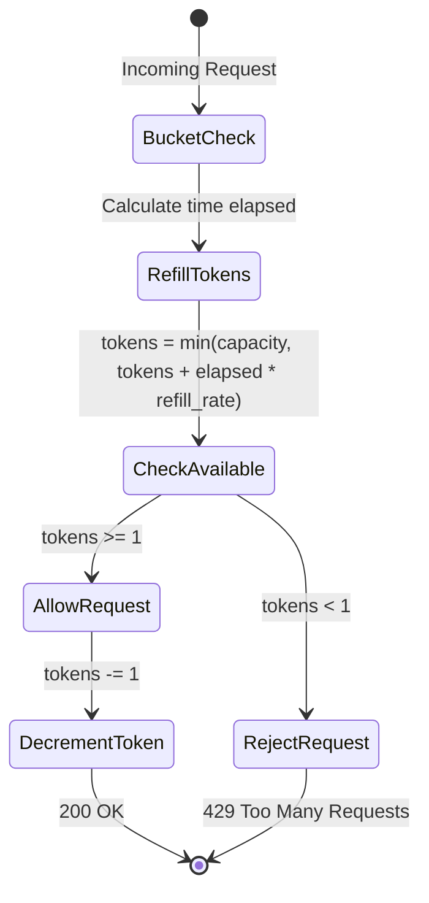

## Overview

LLM Gateway Core implements distributed rate limiting using the **token bucket algorithm** with Redis Lua scripts. This ensures atomic operations and prevents race conditions in multi-instance deployments.

## Why Rate Limiting?

<CardGroup cols={2}>
  <Card title="Protect Resources" icon="shield">
    Prevent abuse and ensure fair resource allocation
  </Card>
  <Card title="Cost Control" icon="dollar-sign">
    Limit expensive API calls to cloud providers
  </Card>
  <Card title="SLA Compliance" icon="file-contract">
    Enforce usage quotas for different API key tiers
  </Card>
  <Card title="Stability" icon="server">
    Prevent system overload from traffic spikes
  </Card>
</CardGroup>

## Token Bucket Algorithm

The token bucket algorithm works as follows:

1. Each client has a bucket with a maximum **capacity** of tokens
2. Tokens are **refilled** at a constant rate per second
3. Each request **consumes** one token
4. Requests are rejected when the bucket is empty



## Implementation

The `RedisRateLimiter` class in `app/core/rate_limiter.py` implements the token bucket:

```python
import time
import redis
from app.core.config import settings

class RedisRateLimiter:
    def __init__(self, capacity: int, refill_rate: float):
        self.capacity = capacity
        self.refill_rate = refill_rate
        self.client = redis.from_url(settings.REDIS_URL, decode_responses=True)
        
        # Lua script for atomic token bucket update
        self._lua_script = """
        local key = KEYS[1]
        local capacity = tonumber(ARGV[1])
        local refill_rate = tonumber(ARGV[2])
        local now = tonumber(ARGV[3])
        
        local state = redis.call('HMGET', key, 'tokens', 'last_refill')
        local tokens = tonumber(state[1]) or capacity
        local last_refill = tonumber(state[2]) or now
        
        local elapsed = math.max(0, now - last_refill)
        local refill = elapsed * refill_rate
        tokens = math.min(capacity, tokens + refill)
        
        if tokens >= 1 then
            tokens = tokens - 1
            redis.call('HMSET', key, 'tokens', tokens, 'last_refill', now)
            redis.call('EXPIRE', key, math.ceil(capacity / refill_rate) + 10)
            return 1
        else
            return 0
        end
        """
        self._script_hash = self.client.script_load(self._lua_script)

    def allow(self, key: str) -> bool:
        try:
            now = time.time()
            result = self.client.evalsha(
                self._script_hash, 
                1, 
                f"ratelimit:{key}", 
                self.capacity, 
                self.refill_rate, 
                now
            )
            return bool(result)
        except redis.exceptions.NoScriptError:
            # Reload script if it was flushed from Redis
            self._script_hash = self.client.script_load(self._lua_script)
            return self.allow(key)
        except Exception as e:
            print(f"[RATELIMIT ERROR] key={key}: {e}")
            # Fail open or closed? In real world usually fail open but log heavily
            return True 
```

Source: `app/core/rate_limiter.py:1-56`

## Lua Script Breakdown

The Lua script ensures atomic operations across multiple steps:

### 1. Fetch Current State

```lua
local state = redis.call('HMGET', key, 'tokens', 'last_refill')
local tokens = tonumber(state[1]) or capacity
local last_refill = tonumber(state[2]) or now
```

Retrieves the current token count and last refill timestamp. Defaults to full capacity for new keys.

### 2. Calculate Token Refill

```lua
local elapsed = math.max(0, now - last_refill)
local refill = elapsed * refill_rate
tokens = math.min(capacity, tokens + refill)
```

Calculates how many tokens to add based on elapsed time, capped at capacity.

### 3. Check and Consume Token

```lua
if tokens >= 1 then
    tokens = tokens - 1
    redis.call('HMSET', key, 'tokens', tokens, 'last_refill', now)
    redis.call('EXPIRE', key, math.ceil(capacity / refill_rate) + 10)
    return 1
else
    return 0
end
```

If tokens are available:
- Decrements token count
- Updates state in Redis
- Sets expiration to prevent memory leaks
- Returns 1 (allow)

Otherwise returns 0 (reject).

<Note>
The entire script executes atomically in Redis, preventing race conditions in concurrent scenarios.
</Note>

## Integration with API

Rate limiting is enforced via FastAPI dependency in `app/api/v1/chat.py`:

```python
from fastapi import APIRouter, Depends, Request, HTTPException
from app.core.rate_limiter import RedisRateLimiter
from app.core.metrics import RATE_LIMIT_ALLOWED, RATE_LIMIT_BLOCKED
from app.core.config import settings

# Initialize the rate limiter (Redis-backed)
rate_limiter = RedisRateLimiter(
    capacity=settings.RATE_LIMITER_CAPACITY,
    refill_rate=settings.RATE_LIMITER_REFILL_RATE
)

def get_client_key(request: Request) -> str:
    """Extracts a unique key for the client (API Key or IP)."""
    return request.headers.get("X-API-Key") or request.client.host

async def rate_limit_dependency(request: Request):
    """
    FastAPI dependency to enforce rate limiting and record metrics.
    Also validates the API key if provided.
    """
    api_key = request.headers.get("X-API-Key")
    valid_keys = [k.strip() for k in settings.API_KEYS.split(",") if k.strip()]
    
    if api_key not in valid_keys:
         raise HTTPException(
            status_code=401,
            detail="Invalid or missing API Key"
        )

    key = api_key or request.client.host
    if not rate_limiter.allow(key):
        RATE_LIMIT_BLOCKED.inc()
        raise HTTPException(
            status_code=429, 
            detail="Too many requests. Please wait before trying again."
        )
    
    RATE_LIMIT_ALLOWED.inc()

@app.post("", response_model=ChatResponse, dependencies=[Depends(rate_limit_dependency)])
async def chat(request: ChatRequest):
    """
    Entry point for all chat completions.
    Processes the chat request and returns a chat response.
    """
    return await chat_service.chat(request)
```

Source: `app/api/v1/chat.py:1-53`

## Rate Limit Key Strategy

The rate limiter uses a composite key strategy:

```python
def get_client_key(request: Request) -> str:
    """Extracts a unique key for the client (API Key or IP)."""
    return request.headers.get("X-API-Key") or request.client.host
```

**Priority:**
1. **API Key** - If provided, rate limit per API key
2. **IP Address** - Fallback to IP-based limiting

This allows:
- Different rate limits for different API key tiers
- IP-based protection against unauthenticated abuse
- Flexible quota management

<Tip>
The key is prefixed with `ratelimit:` in Redis to namespace it and avoid collisions with cache keys.
</Tip>

## Configuration

Rate limiting is configured via environment variables:

```bash
# Token bucket capacity (maximum tokens)
RATE_LIMITER_CAPACITY=100

# Tokens added per second
RATE_LIMITER_REFILL_RATE=1.0
```

### Example Configurations

<CodeGroup>
```bash Conservative
# 10 requests per minute
RATE_LIMITER_CAPACITY=10
RATE_LIMITER_REFILL_RATE=0.166  # 10/60
```

```bash Moderate
# 100 requests per minute
RATE_LIMITER_CAPACITY=100
RATE_LIMITER_REFILL_RATE=1.666  # 100/60
```

```bash Permissive
# 1000 requests per minute
RATE_LIMITER_CAPACITY=1000
RATE_LIMITER_REFILL_RATE=16.666  # 1000/60
```
</CodeGroup>

## Burst Handling

The token bucket algorithm naturally handles bursts:

- **Capacity** determines maximum burst size
- **Refill rate** determines sustained throughput

**Example:** `capacity=100, refill_rate=1.0`

- Client can burst up to 100 requests immediately
- After burst, limited to 1 request/second
- Bucket refills to allow future bursts


## Error Handling

The rate limiter implements multiple error handling strategies:

### Script Reload

```python
except redis.exceptions.NoScriptError:
    # Reload script if it was flushed from Redis
    self._script_hash = self.client.script_load(self._lua_script)
    return self.allow(key)
```

Automatically reloads the Lua script if Redis was restarted or flushed.

### Fail-Open Strategy

```python
except Exception as e:
    print(f"[RATELIMIT ERROR] key={key}: {e}")
    # Fail open or closed? In real world usually fail open but log heavily
    return True
```

If Redis is unavailable, the system **fails open** (allows requests) to maintain availability. This prevents total outage if Redis goes down.

<Warning>
Failing open means rate limits won't be enforced during Redis outages. Monitor Redis health and consider failing closed for high-security scenarios.
</Warning>

## Metrics and Monitoring

Rate limiting records Prometheus metrics:

```python
RATE_LIMIT_ALLOWED.inc()  # Request allowed
RATE_LIMIT_BLOCKED.inc()  # Request rejected (429)
```

### Key Metrics

- **Block Rate** - `RATE_LIMIT_BLOCKED / (RATE_LIMIT_ALLOWED + RATE_LIMIT_BLOCKED)`
- **Top Offenders** - API keys/IPs with highest block rate
- **Rate Limit Errors** - Redis connection failures

## Redis State Structure

Each rate limit key stores a hash in Redis:

```redis
HMGET ratelimit:api-key-123 tokens last_refill

# Returns:
# 1) "47.5"          # Current token count (float)
# 2) "1678901234.56" # Last refill timestamp (unix time)
```

### Expiration

Keys automatically expire to prevent memory leaks:

```lua
redis.call('EXPIRE', key, math.ceil(capacity / refill_rate) + 10)
```

Expiration time = time to fully refill bucket + 10 second buffer

## Testing Rate Limits

### Test Script

```python
import httpx
import asyncio

async def test_rate_limit():
    async with httpx.AsyncClient() as client:
        for i in range(105):
            response = await client.post(
                "http://localhost:8000/chat",
                headers={"X-API-Key": "test-key"},
                json={
                    "messages": [{"role": "user", "content": f"Request {i}"}]
                }
            )
            print(f"Request {i}: {response.status_code}")
            if response.status_code == 429:
                print(f"Rate limited at request {i}")
                break

asyncio.run(test_rate_limit())
```

### Expected Output

```
Request 0: 200
Request 1: 200
...
Request 99: 200
Request 100: 429
Rate limited at request 100
```

## Advanced: Per-Tier Rate Limits

You can implement different rate limits for different API key tiers:

```python
class TieredRateLimiter:
    def __init__(self):
        self.tiers = {
            "free": RedisRateLimiter(capacity=10, refill_rate=0.166),
            "pro": RedisRateLimiter(capacity=100, refill_rate=1.666),
            "enterprise": RedisRateLimiter(capacity=1000, refill_rate=16.666),
        }
    
    def allow(self, api_key: str) -> bool:
        tier = self.get_tier(api_key)  # Look up tier from database
        return self.tiers[tier].allow(api_key)
```

## Best Practices

<AccordionGroup>
  <Accordion title="Set appropriate capacity and refill rate">
    Capacity should allow reasonable bursts, while refill rate controls sustained load. Test with realistic traffic patterns.
  </Accordion>
  
  <Accordion title="Use Redis persistence">
    Enable AOF or RDB persistence to preserve rate limit state across Redis restarts.
  </Accordion>
  
  <Accordion title="Monitor block rates">
    High block rates may indicate legitimate users hitting limits. Consider adjusting capacity or implementing tiered limits.
  </Accordion>
  
  <Accordion title="Consider fail-closed for security">
    In high-security scenarios, fail closed (reject requests) during Redis outages instead of failing open.
  </Accordion>
  
  <Accordion title="Implement retry-after headers">
    Return a `Retry-After` header in 429 responses to help clients back off appropriately.
  </Accordion>
</AccordionGroup>

## Response Headers

You can enhance the rate limiting by adding informational headers:

```python
response.headers["X-RateLimit-Limit"] = str(self.capacity)
response.headers["X-RateLimit-Remaining"] = str(int(tokens))
response.headers["X-RateLimit-Reset"] = str(int(now + (1.0 / self.refill_rate)))
```

This allows clients to track their quota and implement intelligent retry logic.

## Next Steps

<CardGroup cols={2}>
  <Card title="Architecture" href="/architecture">
    See how rate limiting fits into the system
  </Card>
  <Card title="Caching" href="/caching">
    Learn about Redis caching implementation
  </Card>
  <Card title="Monitoring" href="/monitoring/overview">
    Set up metrics and alerts
  </Card>
  <Card title="API Reference" href="/api/chat">
    Complete API documentation
  </Card>
</CardGroup>