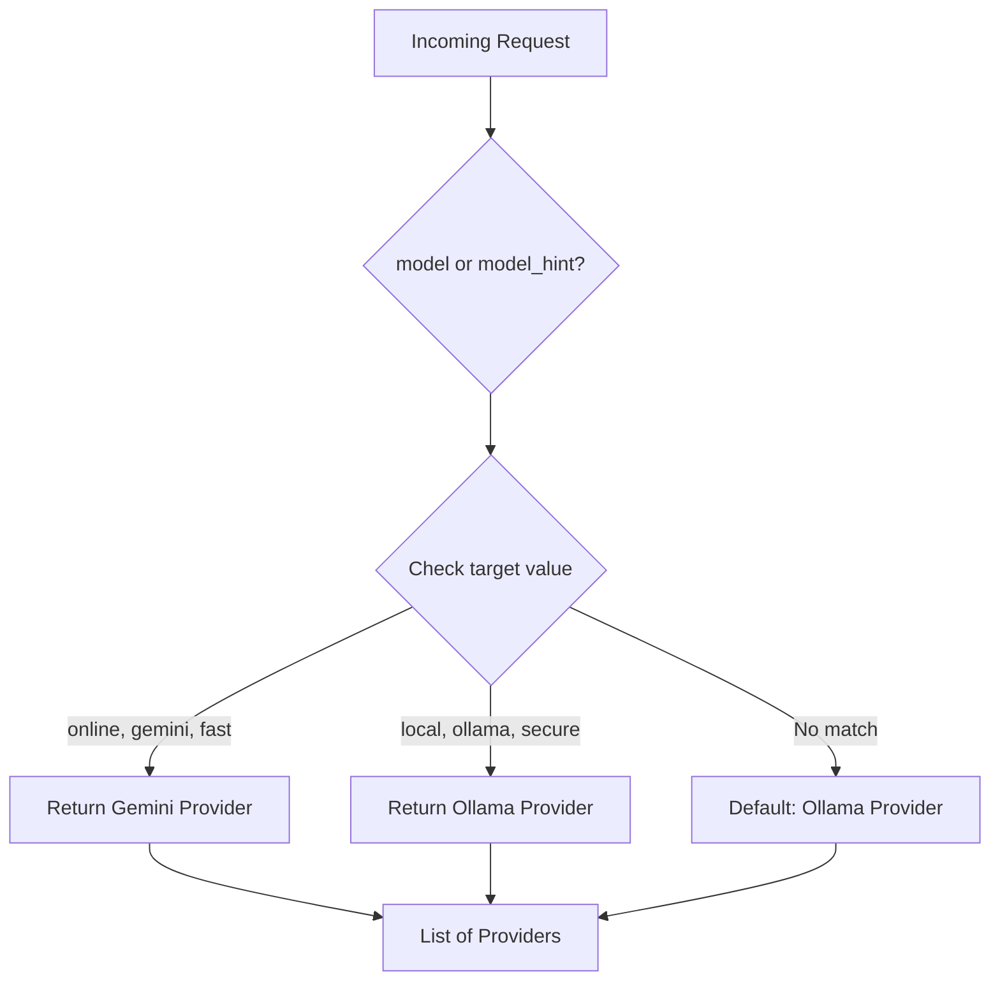

## Overview

The Router component determines which LLM provider should handle each incoming request. Routing decisions are based on the `model` or `model_hint` field in the request, allowing clients to control which provider is used.

## Router Implementation

The `Router` class in `app/core/router.py` manages provider selection:

```python
from typing import List 
from app.providers.base import LLMProvider
from app.providers.gemini import GeminiProvider
from app.providers.ollama import OllamaProvider

class Router:
    """
    Decides which providers should handle a request.
    """
    def __init__(self):
        self.providers = {
            "gemini": GeminiProvider(),
            "ollama": OllamaProvider(),
        }
    
    def route(self, request) -> List[LLMProvider]:
        """
        Routes the request to the appropriate provider.
        """
        # Prioritize explicit model selection
        target = request.model or request.model_hint
        
        if target == "online" or target == "gemini" or target == "fast":
            return [self.providers["gemini"]]
        elif target == "ollama" or target == "local" or target == "secure":
            return [self.providers["ollama"]]
            
        # Default fallback
        return [self.providers["ollama"]]
```

## Model Hints

The router supports semantic hints that map to provider characteristics:

### Gemini Provider Hints

These hints route requests to Google's Gemini (cloud-based):

<CodeGroup>
```json online
{
  "model_hint": "online",
  "messages": [...]
}
```

```json gemini
{
  "model_hint": "gemini",
  "messages": [...]
}
```

```json fast
{
  "model_hint": "fast",
  "messages": [...]
}
```
</CodeGroup>

- `online` - Routes to cloud-based provider
- `gemini` - Explicitly selects Gemini
- `fast` - Optimizes for speed (cloud providers are typically faster)

### Ollama Provider Hints

These hints route requests to Ollama (local/self-hosted):

<CodeGroup>
```json local
{
  "model_hint": "local",
  "messages": [...]
}
```

```json ollama
{
  "model_hint": "ollama",
  "messages": [...]
}
```

```json secure
{
  "model_hint": "secure",
  "messages": [...]
}
```
</CodeGroup>

- `local` - Routes to self-hosted provider
- `ollama` - Explicitly selects Ollama
- `secure` - Prioritizes data privacy (local processing)

## Routing Priority

The router follows this priority order:

1. **Explicit `model` field** - If present, takes precedence over `model_hint`
2. **Model hint** - Semantic hint for provider selection
3. **Default fallback** - Routes to Ollama if no hint is provided

```python
target = request.model or request.model_hint
```

<Note>
The `model` field takes precedence over `model_hint`, allowing clients to override hints with explicit provider selection.
</Note>

## Routing Decision Flow



## Provider List Return

The `route()` method returns a **list** of providers:

```python
def route(self, request) -> List[LLMProvider]:
```

This design allows for future enhancements:

- **Fallback chains** - Try multiple providers in sequence
- **Load balancing** - Distribute requests across multiple instances
- **A/B testing** - Route requests to different providers for comparison

<Tip>
Currently, the router returns a single-item list, but the `ChatService` iterates through all providers with retry logic, making it easy to add fallback providers in the future.
</Tip>

## Integration with ChatService

The `ChatService` uses the router to get providers and iterates through them with retry logic:

```python
providers = self.router.route(request)
last_exception = None

for provider in providers:
    for attempt in range(settings.PROVIDER_MAX_RETRIES):
        try:
            response = await self._call_provider(provider, request)
            self.cache.set(cache_key, response)
            return response
        except Exception as e:
            last_exception = e
            continue
raise last_exception if last_exception else Exception("No providers available")
```

Source: `app/core/service.py:55-67`

## Usage Examples

### Request with Gemini Provider

```python
import httpx

response = await httpx.post(
    "http://localhost:8000/chat",
    headers={"X-API-Key": "your-api-key"},
    json={
        "model_hint": "fast",
        "messages": [
            {"role": "user", "content": "What is the capital of France?"}
        ],
        "max_tokens": 100
    }
)
```

### Request with Ollama Provider

```python
import httpx

response = await httpx.post(
    "http://localhost:8000/chat",
    headers={"X-API-Key": "your-api-key"},
    json={
        "model_hint": "secure",
        "messages": [
            {"role": "user", "content": "Analyze this sensitive document..."}
        ],
        "max_tokens": 500
    }
)
```

### Default Routing (No Hint)

```python
import httpx

response = await httpx.post(
    "http://localhost:8000/chat",
    headers={"X-API-Key": "your-api-key"},
    json={
        "messages": [
            {"role": "user", "content": "Hello!"}
        ]
    }
)
# Routes to Ollama (default)
```

## Provider Interface

All providers implement the `LLMProvider` base class interface, ensuring consistent behavior:

```python
from app.providers.base import LLMProvider

class CustomProvider(LLMProvider):
    async def chat(self, request: ChatRequest) -> ChatResponse:
        # Implementation
        pass
```

## Adding New Providers

To add a new provider:

1. Create a new provider class implementing `LLMProvider`
2. Register it in the `Router.__init__()` providers dictionary
3. Add routing logic in `Router.route()` with appropriate hints

```python
class Router:
    def __init__(self):
        self.providers = {
            "gemini": GeminiProvider(),
            "ollama": OllamaProvider(),
            "custom": CustomProvider(),  # New provider
        }
    
    def route(self, request) -> List[LLMProvider]:
        target = request.model or request.model_hint
        
        if target == "custom" or target == "specialized":
            return [self.providers["custom"]]
        # ... existing logic
```

## Best Practices

<AccordionGroup>
  <Accordion title="Use semantic hints for flexibility">
    Use hints like `fast`, `secure`, `local` instead of explicit provider names. This allows you to change the underlying provider without updating client code.
  </Accordion>
  
  <Accordion title="Set appropriate defaults">
    The default fallback routing ensures requests never fail due to missing hints. Choose a default that matches your primary use case.
  </Accordion>
  
  <Accordion title="Document provider characteristics">
    Make sure clients understand what each hint means (speed, privacy, cost) so they can make informed routing decisions.
  </Accordion>
</AccordionGroup>

## Next Steps

<CardGroup cols={2}>
  <Card title="Architecture" href="/architecture">
    Understand the full system architecture
  </Card>
  <Card title="Caching" href="/caching">
    Learn how responses are cached
  </Card>
  <Card title="Rate Limiting" href="/rate-limiting">
    Explore rate limiting implementation
  </Card>
  <Card title="API Reference" href="/api/chat">
    Complete API documentation
  </Card>
</CardGroup>